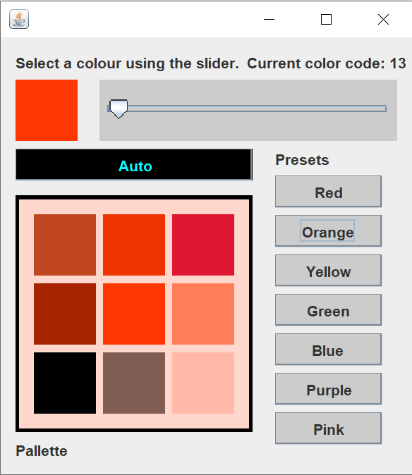

# COLOUR PALETTE

## Description
This program is designed to be a lightweight colour palette generator for creative projects. It uses a slider to select a hue, and then generates a 9 swatch colour palette based off the initial selection.

To download the latest release, visit the [releases page](https://github.com/mrbrianevans/colour-palette/releases/latest)

